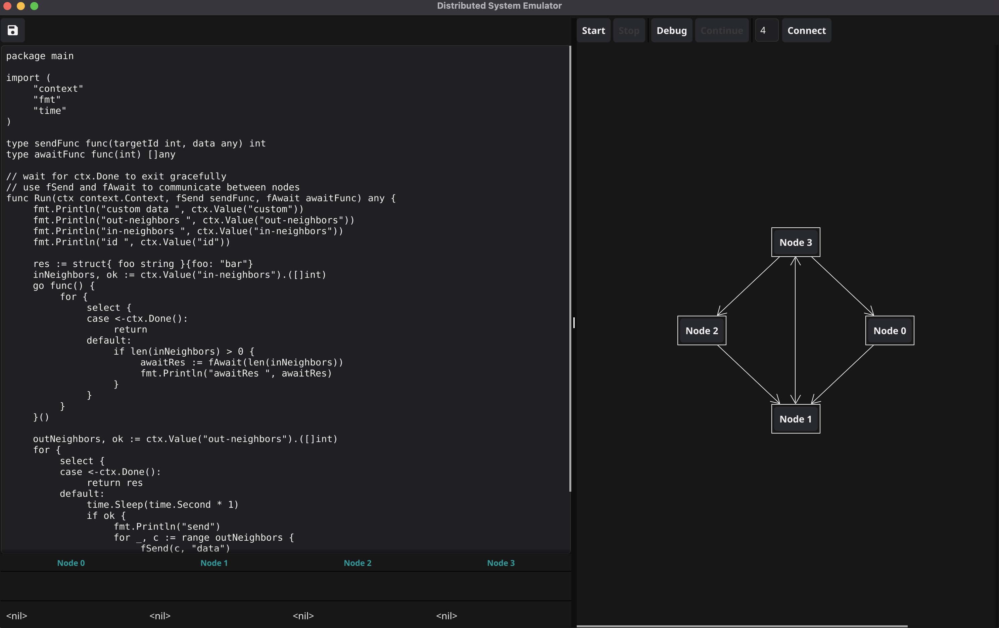

# P2PSim
[](https://github.com/yesoer/P2PSim/actions)

A simplified environment to test, develop and analyze peer 2 peer systems/algorithms.

 > **Note :** Not production ready but under active development.

## Table of Contents
- [Get Started](#get-started)
  - [Build](#build)
  - [Run](#run)
  - [Use](#use)
- [Features to be Implemented](#features-to-be-implemented)
- [Contribution](#contribution)
  - [Branch Naming](#branch-naming)
  - [Commit Messages](#commit-messages)
  - [Other Tips/Notes on Contributing](#other-tipsnotes-on-contributing)

## Get Started

### Build

```sh
go build main.go
```

### Run

```sh
./main
```

Find the supported flags using
```sh
./main -help
```

### Use

The main window is split into two panes :



Your editor on the left where you will write the code running on your nodes and inspect outputs through the consoles below. 

On the right you can inspect and modify your network diagram by changing connections, the number of nodes and node specific data.

Your codes entry point has to be a function of the following signature :
```go
type sendFunc func(targetId int, data any) int
type awaitFunc func(int) []any

func Run(ctx context.Context, fSend sendFunc, fAwait awaitFunc) any
```

Where `ctx` includes some node specific data :
| name          | description                                       | type    |
|---------------|---------------------------------------------------|---------|
| id            | This nodes id                                     | int     |
| custom        | Custom data as configured in the right pane       | any     |
| out-neighbors | Other nodes (ids) that this node can send to      | []int   |
| in-neighbors  | Other nodes (ids) that this node can receive from | []int   |


And fSend and fAwait are your tools for communication. They allow the corresponding node to send any data to one specific neighboring node or await/receive a number of messages from all incoming connections.

> **Note :** Code examples can be found under `resources`.

## Features to be Implemented

This section might be helpful if you are wondering where this project is going or what you might want to contribute. If you are starting out though maybe have a look at in-code TODOs first since they are probably easier.

Topics to implement (no specific order) : 

- Draw edges/connections using drag and drop
- Code generation enabling easy migration to the real world
  - Node setup
  - Certain connection schemes as described in the next feature
  - Communication via fSend/fAwait
- Connection schemes
  - Quick connect : chord ring, tree (random or binary)
  - Define connections using a go function e.g. to connect nodes depending on the custom data/ids
- Intermediate logs (e.g. via streaming, see TODO in Node.Run())
- Stress test functionality with varying configurations
  - Could/should also include some simple timing, CPU, RAM inspection mechanisms etc. for benchmarking

Topics to look into (whether we want them) :
- Port numbering model ? LOCAL model ?
- Automated proof generation (probably requires restriction to certain instructions etc.)
- Support of an actual editor e.g. a neovim widget would be awesome

Minimizing what users have to do and optimizing how they do it, is a continuous effort.

## Contribution

When confused, no worries, just publish what you have. 
A not perfectly structured contribution is still far better than nothing.

### Branch Naming 

Branch names should look like this
`<prefix>/<type>/<name>`

Where `<prefix>` is optional and you will probably never use it but you could use `WIP/` to mark branches which will probably exist for a long time and should be protected. This can be useful for more experimental or research heavy tasks.

`<type>` is one of the following (extend if needed) :

| type | when to use      |
|------|------------------|
| feat | any new features |
| maintenance | any work on docs, git workflows, tests etc. |
| refactor | when refactoring existing parts of the application |
| fix  | bug fixes        |
| test | testing environments/throwaway branches |

`<name>` is a short description of what you are doing, words should be seperated using '-'.

### Commit Messages

More specific distinction happens in **commit messages** which should be structured
as follows :

```
<type>(<scope>): <subject>
```

- **type**
Must be one of the following:

  * **feat**: A new feature
  * **fix**: A bug fix
  * **docs**: Documentation only changes
  * **style**: Changes that do not affect the meaning of the code (white-space, formatting, missing
    semi-colons, etc)
  * **refactor**: A code change that neither fixes a bug nor adds a feature
  * **perf**: A code change that improves performance
  * **test**: Adding missing or correcting existing tests
  * **chore**: Changes to the build process or auxiliary tools and libraries such as documentation
  generation

- **scope** refers to the part of the software, which usually will be best identified by the package name.

- **subject** gives a short idea of what was done/what the intend of the commit is.

As for the **commit body** there is no mandatory structure as of now.

### Other Tips/Notes on Contributing

**Issues and Pull Requests** for now will not have any set guidelines.

As a rule of thumb for **merging** make sure to rebase before doing so.

When developing or testing you should consider using the -race flag to make sure
your contribution is fine.
Eventhough your code might seem to run flawlessly, it might be buggy.

Check out [Code Review Comments](https://github.com/golang/go/wiki/CodeReviewComments) for commmon code review topics around golang.

If you're looking for things that you could do have a look at the [Features to be Implemented](#features-to-be-implemented) section or the TODOs within the code base.
